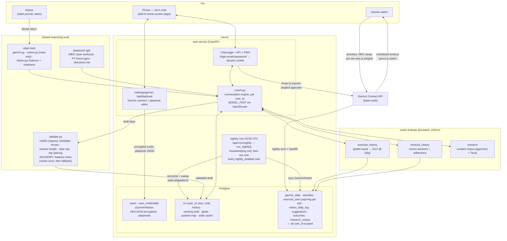

# Jim — architecture

One cheap-LLM agent (the chat), a nightly cron that does housekeeping only —
no auto-drafted plan — a hard deterministic guardrail in front of anything
that reaches the watch, and memory split by how durable it is.

## The flow, in words

**Around the clock** — every strength session you log flows back: the nightly
sync stores the activity *and its per-set data* (`exercise_sets`: category,
exercise, reps, kg). That's the progression memory: when you ask Jim to "bump
goblet squats," it calls `exercise_history("goblet squat")`, sees
`2026-07-05: 3x12 @ 16kg`, and prescribes conservatively from reality.

**Nightly** (`jobs/nightly.py`, Vercel Cron at 20:00 UTC — deliberately after
the training day) — housekeeping only, no plan is written here. `run_nightly()`
selects every `users` row with `nightly_enabled = true` and runs the per-user
pipeline for each in turn: sync today's Garmin + Notion into Postgres (that
user's own credentials, that user's own `users.timezone` for "today") → sweep
stale one-off Garmin adaptations whose day has passed (built by chat, never
promoted into the playbook) → reconcile today's plan vs. actuals for the
adherence signal. One user's failure (expired Garmin creds, Notion down, a
Garmin hiccup during cleanup) is caught and logged at the per-user boundary —
it doesn't stop the rest of the run. The whole run must finish inside the
function's `maxDuration`, so it returns `elapsed_sec` alongside a per-user
result map.

**Any time, in chat** (`coach.py`) — one continuous conversation. Each turn:
state snapshot (cached 1h, each source degrading independently) + playbook +
goals + current draft + balance notes + last 30 messages → the model may make
up to 4 lookups (exercise history, workout history, research) → returns
`{reply, draft?, goals?}`. A returned draft is **merged by date** onto the
existing plan, so a single-day edit can't silently drop the rest of the week;
the merged plan is then validated as a whole (leg spacing only means something
when the days are seen together), revised once, and any day still failing is
dropped with a note. Saying "my long-term goal is…" rewrites the goals block —
memory without scheduling.

**Pushing** — the draft reaches the watch only on an explicit button: **Push to
Garmin** (whole draft, `coach.approve`) or a single day (`coach.push_day`).
Template days schedule the existing Garmin workout by ID (loaded weights
preserved); adapted days are created fresh. Re-pushing a day unschedules the
previous one first, so the watch never ends up with duplicates. Pushed days are
recorded `source='chat'` and tracked in the `pushed` kv map with a content
hash, which is what lets the UI badge a day as *pushed* or *modified since
push*.

## Multi-tenant data model

One deployment, one Postgres, any number of `users` rows — isolation is
enforced by `user_id`, not by separate databases. `users` holds login +
`timezone` + `nightly_enabled`; `user_credentials` holds each account's Garmin
email/password and Notion token, AES-GCM encrypted at rest
(`crypto.py`, key in `CREDENTIAL_ENCRYPTION_KEY`, never in the DB); `playbooks`
holds one JSONB row per account (base workouts, PT routines, rotation,
directives — edited via `/api/playbook`, seeded generic at signup). Every
history table (`kv`, `garmin_daily`, `garmin_activities`, `exercise_sets`,
`notion_daily_log`, `suggestions`, `outcomes`) carries `user_id` as part of its
primary key. `tools/garmin.py`/`tools/notion.py` keep a per-`user_id` client
cache (a plain dict, since each serverless instance is single-process); every
`Toolbox`/`CoachDeps` lambda closes over the `user_id` it was built for.

## Memory hierarchy

| Layer | Store | Written by | Horizon |
|---|---|---|---|
| directives.md | git | you | standing policy |
| goals | Postgres kv | chat | months |
| draft | Postgres kv | chat | this week |
| pushed | Postgres kv | the push buttons | until re-pushed |
| exercise_sets / suggestions / outcomes | Postgres | the system | history |

## Cost discipline

- Deterministic Python computes features; the LLM only composes and converses.
- Nightly housekeeping (sync/reconcile/cleanup) makes zero LLM calls.
- Chat: 1 LLM call per turn + ≤4 lookup rounds, state cached for an hour,
  history truncated to the last 30 messages, research gated by a heuristic.
- Guardrail, balance maths, and fallback are code, not model.
