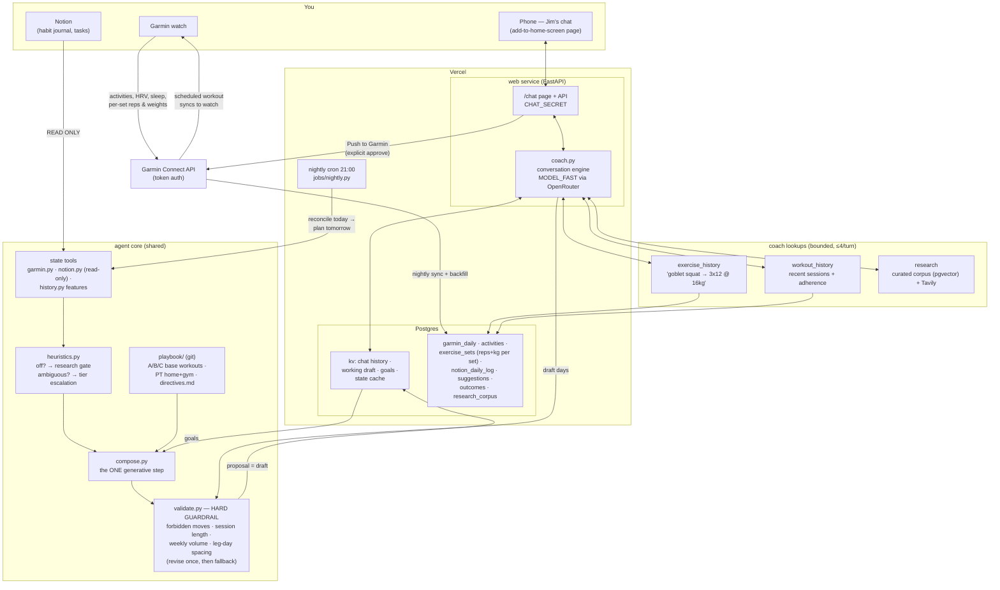

# Jim — architecture

One cheap-LLM agent, two entry points (a nightly cron and a chat), a hard
deterministic guardrail in front of anything that reaches the watch, and
memory split by how durable it is.

## The flow, in words

**Around the clock** — every strength session you log flows back: the nightly
sync stores the activity *and its per-set data* (`exercise_sets`: category,
exercise, reps, kg). That's the progression memory: when you ask Jim to "bump
goblet squats," it calls `exercise_history("goblet squat")`, sees
`2026-07-05: 3x12 @ 16kg`, and prescribes conservatively from reality.

**21:00 nightly** (`jobs/nightly.py`) — reconcile today's plan vs. actuals →
sync state → *if you already chat-planned tomorrow, stop* → otherwise: read
state + playbook + goals → cheap-heuristic research gate → compose (one LLM
call, escalating to the quality tier only on ambiguous state) → guardrail →
the proposal lands as the **chat draft**. Nothing is pushed unattended
(AUTO_PUSH stays off until the M5 evals gate it).

**Any time, in chat** (`coach.py`) — one continuous conversation. Each turn:
state snapshot (cached 1h) + playbook + goals + current draft + last 30
messages → the model may make up to 4 lookups (exercise history, workout
history, research) → returns `{reply, draft?, goals?}`. Draft days pass the
same guardrail. Saying "my long-term goal is…" rewrites the goals block —
memory without scheduling. **Push to Garmin** schedules each draft day
(template days by ID with your loaded weights; adapted days created fresh)
and marks them `source='chat'` so the nightly run steps aside.

## Memory hierarchy

| Layer | Store | Written by | Horizon |
|---|---|---|---|
| directives.md | git | you | standing policy |
| goals | Postgres kv | chat | months |
| draft | Postgres kv | chat + nightly | this week |
| exercise_sets / suggestions / outcomes | Postgres | the system | history |

## Cost discipline

- Deterministic Python computes features; the LLM only composes and converses.
- Nightly: ≤2 LLM calls (compose + one revision), research gated by a
  heuristic, quality tier only on ambiguous state, hard tool-call cap.
- Chat: 1 LLM call per turn + ≤4 lookups, state cached, history truncated.
- Guardrail and fallback are code, not model.
