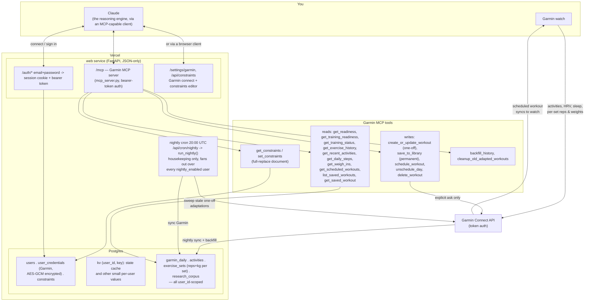

# Jim — architecture

Claude is the reasoning engine. It talks to Garmin directly through a Garmin
MCP server (`mcp_server.py`, mounted at `/mcp`); there's no separate coach
model or conversation loop behind it. A nightly cron does housekeeping only —
no auto-drafted plan — and memory is split by how durable it is. There's no
code-enforced guardrail in front of the write tools; `skills/jim-coach/
SKILL.md` is the safety layer instead.

```mermaid
flowchart TB
    subgraph you["You"]
        WATCH["Garmin watch"]
        CLAUDE["Claude<br/>(the reasoning engine, via an MCP-capable client)"]
    end

    subgraph vercel["Vercel"]
        subgraph web["web service (FastAPI, JSON-only)"]
            MCPAPI["/mcp — Garmin MCP server<br/>(mcp_server.py, bearer-token auth)"]
            AUTHAPI["/auth/* email+password -> session cookie + bearer token"]
            SETTINGS["/settings/garmin, /api/constraints<br/>Garmin connect + constraints editor"]
        end
        CRON["nightly cron 20:00 UTC<br/>/api/cron/nightly -> run_nightly()<br/>housekeeping only, fans out over<br/>every nightly_enabled user"]
        subgraph pg["Postgres"]
            USERS["users . user_credentials (Garmin,<br/>AES-GCM encrypted) . constraints"]
            KV["kv (user_id, key): state cache<br/>and other small per-user values"]
            TABLES["garmin_daily . activities .<br/>exercise_sets (reps+kg per set) .<br/>research_corpus<br/>— all user_id-scoped"]
        end
    end

    subgraph tools["Garmin MCP tools"]
        READS["reads: get_readiness, get_training_readiness,<br/>get_training_status, get_exercise_history,<br/>get_recent_activities, get_daily_steps,<br/>get_weigh_ins, get_scheduled_workouts,<br/>list_saved_workouts, get_saved_workout"]
        WRITES["writes: create_or_update_workout (one-off),<br/>save_to_library (permanent), schedule_workout,<br/>unschedule_day, delete_workout"]
        CONSTRAINTS["get_constraints / set_constraints<br/>(full-replace document)"]
        BACKFILL["backfill_history, cleanup_old_adapted_workouts"]
    end

    GARMINAPI["Garmin Connect API<br/>(token auth)"]

    WATCH -->|"activities, HRV, sleep,<br/>per-set reps & weights"| GARMINAPI
    GARMINAPI -->|"nightly sync + backfill"| TABLES

    CRON -->|"sync Garmin"| TABLES
    CRON -->|"sweep stale one-off<br/>adaptations"| GARMINAPI

    CLAUDE <--> MCPAPI
    MCPAPI --> READS & WRITES & CONSTRAINTS & BACKFILL
    READS --> TABLES
    CONSTRAINTS --> USERS
    WRITES -->|"explicit ask only"| GARMINAPI
    GARMINAPI -->|"scheduled workout<br/>syncs to watch"| WATCH

    CLAUDE <-->|"connect / sign in"| AUTHAPI --> USERS
    CLAUDE <-->|"or via a browser client"| SETTINGS
```

## The flow, in words

**Around the clock** — every strength session you log flows back: the nightly
sync stores the activity *and its per-set data* (`exercise_sets`: category,
exercise, reps, kg). That's the progression memory: when you ask Jim to "bump
goblet squats," it calls `get_exercise_history("goblet squat")`, sees
`2026-07-05: 3x12 @ 16kg`, and prescribes conservatively from reality.

**Nightly** (`jobs/nightly.py`, Vercel Cron at 20:00 UTC — deliberately after
the training day) — housekeeping only, no plan is written here. `run_nightly()`
selects every `users` row with `nightly_enabled = true` and runs the per-user
pipeline for each in turn: sync today's Garmin into Postgres (that
user's own credentials, that user's own `users.timezone` for "today") → sweep
stale one-off Garmin adaptations Claude created (titled with the
`ADAPTED_WORKOUT_PREFIX` marker, `jobs/nightly.cleanup_adapted_workouts`)
whose day has passed → reconcile today's plan vs. actuals. One user's
failure (expired Garmin creds, a Garmin hiccup during cleanup) is caught and
logged at the per-user boundary — it doesn't stop the rest of the run. The
whole run must finish inside the function's `maxDuration`, so it returns
`elapsed_sec` alongside a per-user result map.

**Any time, through the MCP server** (`mcp_server.py`) — an MCP-capable
client (Claude) calls tools directly: read constraints and real history
first, propose a session as readable text, and only write to Garmin
(`create_or_update_workout`, `save_to_library`, `schedule_workout`,
`unschedule_day`, `delete_workout`) on an explicit ask. There's no
server-side conversation state or draft-merge step — each tool call acts
immediately against Garmin or Postgres, and the judgment calls a backend
guardrail used to make (forbidden movements, never pushing without
confirmation, treating `set_constraints` as a full replace) are the model's
to make, per `skills/jim-coach/SKILL.md`.

**Pushing** — nothing reaches the watch except an explicit MCP write-tool
call. `create_or_update_workout` builds a one-off adapted session (auto
`"Jim · "`-prefixed title, swept once its date passes); `save_to_library`
creates a permanent, unprefixed, never-swept workout; `schedule_workout`
puts an existing workout (by id) on the calendar; `unschedule_day` clears a
date; `delete_workout` removes a workout outright. Garmin itself is the only
source of truth for what's scheduled — there's no separate Jim-side "what's
pushed" ledger to keep in sync.

## Multi-tenant data model

One deployment, one Postgres, any number of `users` rows — isolation is
enforced by `user_id`, not by separate databases. `users` holds login +
`timezone` + `nightly_enabled`; `user_credentials` holds each account's Garmin
email/password, AES-GCM encrypted at rest (`crypto.py`, key in
`CREDENTIAL_ENCRYPTION_KEY`, never in the DB); `constraints` holds one row per
account (knee/ankle limits, standing rules, goals — read/written via
`get_constraints`/`set_constraints`, a full-document replace, empty at
signup). Every history table (`kv`, `garmin_daily`, `garmin_activities`,
`exercise_sets`) carries `user_id` as part of its primary key.
`tools/garmin.py` keeps a per-`user_id` client cache (a plain dict, since
each serverless instance is single-process); every MCP tool call
re-resolves its caller fresh from the bearer token (see `mcp_server.py`'s
docstring for why nothing about identity is cached).

## Memory hierarchy

| Layer | Store | Written by | Horizon |
|---|---|---|---|
| Constraints (knee/ankle limits, standing rules, goals) | Postgres `constraints` | `set_constraints`, on an explicit ask | until next `set_constraints` (full replace) |
| Named/reusable workouts | Garmin's own workout library | `save_to_library`, or the athlete directly in Garmin Connect | until edited/deleted |
| One-off adapted sessions | Garmin's calendar, `"Jim · "`-prefixed | `create_or_update_workout` | until the date passes (auto-swept) |
| exercise_sets / activities / garmin_daily | Postgres | the nightly sync | history |

## Cost discipline

- Deterministic Python computes features (`tools/history.py`); the model
  only reasons and composes when it's actually asked to.
- Nightly housekeeping (sync/reconcile/cleanup) makes zero LLM calls.
- Exercise-name matching to Garmin's taxonomy is lexical first (~85% of
  movements match for free); only doubtful names go to a cheap model
  (`tools/exercise_match.py`), and answers are cached in `kv` forever.
